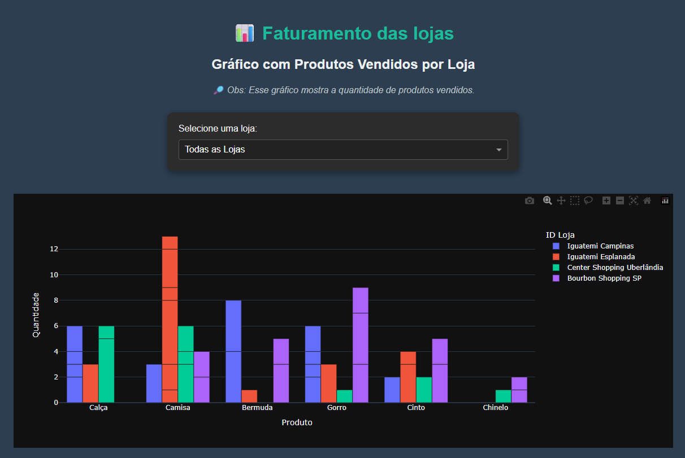

# 📊 Dashboard de Faturamento por Loja

 

Este projeto é um dashboard interativo desenvolvido com **Dash (Plotly + Flask)** que permite visualizar graficamente a quantidade de produtos vendidos por loja.

---

## 💡 Funcionalidades

- Gráfico de barras com os produtos vendidos por loja.
- Filtro interativo por loja usando Dropdown.
- Tema escuro personalizado com visual moderno e confortável aos olhos.
- Layout responsivo e organizado.

---

✨ Tecnologias utilizadas
Dash

Plotly

Pandas

Python 3.8+
